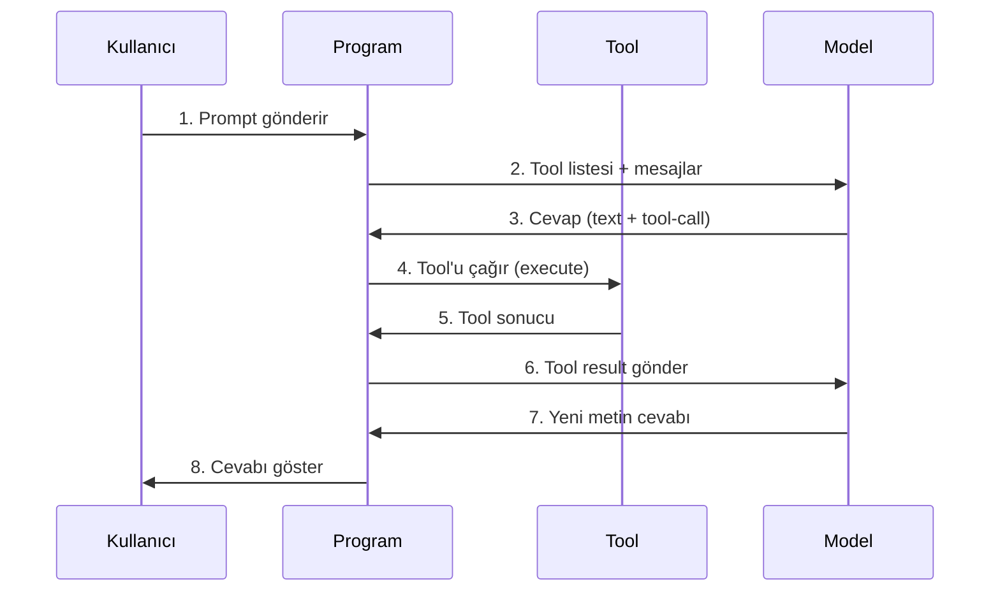

# Model ve Tool'lar Nasıl Çalışıyor?

Bu dokümanda, kullanıcı bir prompt gönderdiğinde **modele ne gidiyor**, **modelden ne geliyor** ve **program bu verilere göre ne yapıyor** adım adım, kod ve metin örnekleriyle anlatılıyor.

---

## Genel akış (yüksekten bakış)



**Sıra ve ne olduğu:**

1. **Kullanıcı prompt gönderir** — Metin (ve varsa dosya) input’a yazılıp “Gönder”e basılır.
2. **Program modele istek atar** — Sistem metni + sohbet geçmişi + **tool listesi** (isim, açıklama, parametre şeması) API’ye gider.
3. **Model cevap üretir** — Önce metin parçaları (stream), gerekiyorsa **tool-call** (hangi tool, hangi argümanlar) döner.
4. **Program tool’u çalıştırır** — Tool-call’ı görünce ilgili tool’un `execute` fonksiyonu, modelin verdiği argümanlarla sunucuda çalışır.
5. **Tool sonucu döner** — `execute` dış API / DB / hesaplama yapıp bir obje döndürür.
6. **Program sonucu modele geri gönderir** — Bu obje “tool result” olarak modele iletilir.
7. **Model yeni metin üretir** — Tool result’a göre kullanıcıya sunulacak cevap metnini üretir (stream).
8. **Program cevabı gösterir** — Gelen metin parçaları birleştirilip ekranda asistan mesajı olarak gösterilir.

---

## Gözle görmek: Nereye bakacaksın?

Olayı kodda görmek istiyorsan şu dosyalara bak:

| Ne görmek istiyorsun? | Dosya | Ne var? |
|----------------------|--------|--------|
| Tool'ların modele nasıl verildiği | `app/(chat)/api/chat/route.ts` | `streamText({ ..., tools: { getWeather, createDocument, ... } })` — satır 141–166. |
| Tool-call geldiğinde hangi fonksiyonun çağrıldığı | Aynı `tools` objesi | Model "getWeather'ı çağır" derse SDK otomatik `getWeather.execute(args)` çağırır. Sen sadece tool listesini veriyorsun. |
| getWeather tanımı ve execute kodu | `lib/ai/tools/get-weather.ts` | `tool({ description, inputSchema, needsApproval, execute })` — tam kod aşağıda. |
| createDocument tanımı | `lib/ai/tools/create-document.ts` | Aynı yapı; execute içinde `dataStream.write(...)` ile UI'a veri yazılıyor. |
| updateDocument tanımı | `lib/ai/tools/update-document.ts` | Var olan dökümanı güncelleme. |
| requestSuggestions tanımı | `lib/ai/tools/request-suggestions.ts` | Döküman için öneri üretme. |
| Ekranda tool mesajı (onay kutusu vb.) | `components/message.tsx` | `type === "tool-getWeather"` — tool-call UI'da bu tip ile gösteriliyor. |

**Kısa özet:** Tool-call = modelin ürettiği bir **JSON parçası** (type, toolCallId, toolName, args). Bu parça **Vercel AI SDK** tarafından okunur; SDK senin verdiğin `tools` objesinden ilgili tool'u bulup `execute(args)` çağırır. Yani "tool-call'ı işleyen" kod senin route'un değil, **SDK**; sen sadece tool listesini tanımlıyorsun.

---

## Tool-call nedir? (Gözle görmek)

**Tool-call**, modelin “şu fonksiyonu şu parametrelerle çağır” demesidir. Model metin yerine **yapısal bir blok** üretir; bu blok bir **JSON objesi**dir. Program bu objeyi okuyup ilgili tool’un `execute` fonksiyonunu çağırır.

### Ekranda / stream’de nasıl görünür?

Model “İstanbul’da hava nasıl?” sorusuna cevap verirken önce birkaç kelime yazar, sonra **bir tool çağırmak istediğini** bu blokla bildirir. Stream’de gelen parça **aynen** şöyle bir şeydir (gerçek örnek formatı):

```json
{
  "type": "tool-call",
  "toolCallId": "call_abc123xyz",
  "toolName": "getWeather",
  "args": {
    "city": "Istanbul"
  }
}
```

| Alan | Ne anlama geliyor? |
|------|--------------------|
| `type: "tool-call"` | Bu parça bir “fonksiyon çağrısı” talebi. |
| `toolCallId` | Bu çağrıyı benzersiz tanıyan id; sonra tool sonucu aynı id ile modele geri gider. |
| `toolName` | Çağrılacak tool’un adı: `getWeather`, `createDocument`, `updateDocument`, `requestSuggestions` vb. |
| `args` | Modelin verdiği parametreler; `execute` fonksiyonuna bu obje gider. |

Yani **tool-call** = “Model diyor ki: getWeather’ı `{ city: "Istanbul" }` ile çağır.” Program bunu görünce `getWeather.execute({ city: "Istanbul" })` çalıştırır.

### Kodda tool-call nerede? (Projedeki gerçek satırlar)

Tool listesi **route** içinde `streamText`'e veriliyor. Model tool-call üretince SDK bu listeden ilgili tool'u bulup `execute` çağırıyor. Sen kodda "tool-call" kelimesini aramasan da, tool-call'ın **sonucu** = bu `execute` fonksiyonlarının çalışması.

**1) Tool'ların modele verildiği yer — `app/(chat)/api/chat/route.ts` (satır 138–172):**

```ts
const result = streamText({
  model: getLanguageModel(selectedChatModel),
  system: systemPrompt({ selectedChatModel, requestHints }),
  messages: modelMessages,
  experimental_activeTools: ["getWeather", "createDocument", "updateDocument", "requestSuggestions"],
  tools: {
    getWeather,
    createDocument: createDocument({ session, dataStream }),
    updateDocument: updateDocument({ session, dataStream }),
    requestSuggestions: requestSuggestions({ session, dataStream }),
  },
  // ...
});
dataStream.merge(result.toUIMessageStream({ sendReasoning: true }));
```

Buradaki `tools` objesi = modele giden tool listesi + her biri için `execute` fonksiyonu. Model stream'de `type: "tool-call", toolName: "getWeather", args: { city: "Istanbul" }` üretince SDK `getWeather.execute({ city: "Istanbul" })` çağırır.

**2) Tool-call'ın UI'da göründüğü yer — `components/message.tsx`:** Mesaj parçaları dönerken `type === "tool-getWeather"` (veya `tool-createDocument` vb.) olan parçalar tool-call'ı temsil eder; getWeather için onay kutusu burada render edilir.

---

### Kullanıcı ekranda ne görür?

- **Metin parçaları:** “İstanbul'daki hava durumuna bakayım.” gibi cümleler normal mesaj gibi akar.
- **Tool-call (onay isteyen tool’da):** getWeather gibi `needsApproval: true` olan tool’larda ekranda bir **onay kutusu** çıkar: “Model getWeather’ı şu parametreyle çağırmak istiyor: Istanbul. İzin ver / Reddet.” Kullanıcı izin verince program `execute`’u çalıştırır.
- **Tool sonucu:** execute’un döndürdüğü veri (örn. sıcaklık, şehir adı) modele “tool result” olarak gider; kullanıcıya doğrudan bu ham veri gösterilmez, model bu veriye göre **yeni metin** üretir (örn. “İstanbul’da şu an 15°C.”).

---

## Projedeki tüm tool'lar (Neler var, ne yapıyor?)

Projede dört tool tanımlı. Hepsi modele **liste** olarak gider (isim + açıklama + parametre şeması). Model hangi tool’u ne zaman kullanacağını bu listeye bakarak kendisi seçer.

**Tek bakışta — hangi tool nerede, ne yapıyor:**

| Tool adı | Dosya | Kısaca ne yapıyor? |
|----------|--------|---------------------|
| `getWeather` | `lib/ai/tools/get-weather.ts` | Şehir/koordinat ver, Open-Meteo'dan hava durumu al; kullanıcı onayı ister. |
| `createDocument` | `lib/ai/tools/create-document.ts` | Başlık + tür (text/code/sheet) ver, sağda yeni artifact oluştur. |
| `updateDocument` | `lib/ai/tools/update-document.ts` | Döküman id + açıklama ver, mevcut artifact'ı güncelle. |
| `requestSuggestions` | `lib/ai/tools/request-suggestions.ts` | Döküman id ver, yazım önerileri üret ve UI + DB'ye yaz. |

Bu dosyaları açtığında her biri `tool({ description, inputSchema, execute })` yapısında; **tool-call** = model bu isimlerden birini + `args` üretir, SDK ilgili `execute`'u çağırır.

### 1. getWeather

| Ne | Değer |
|----|--------|
| **Dosya** | `lib/ai/tools/get-weather.ts` |
| **Açıklama (modele giden)** | "Get the current weather at a location. You can provide either coordinates or a city name." |
| **Parametreler** | `city` (string, isteğe bağlı), `latitude` (number, isteğe bağlı), `longitude` (number, isteğe bağlı). Şehir adı veya enlem/boylam. |
| **Onay** | `needsApproval: true` — Kullanıcıya “Bu parametreyle çağrılsın mı?” diye sorulur. |
| **Ne yapıyor?** | Open-Meteo API’sine istek atar; şehir adından koordinat bulur, hava durumu (sıcaklık, gün doğumu/batımı vb.) döner. |

**Projedeki gerçek kod — `lib/ai/tools/get-weather.ts` (tam tanım):**

```ts
import { tool } from "ai";
import { z } from "zod";

// ... geocodeCity helper (şehir adından enlem/boylam bulur) ...

export const getWeather = tool({
  description:
    "Get the current weather at a location. You can provide either coordinates or a city name.",
  inputSchema: z.object({
    latitude: z.number().optional(),
    longitude: z.number().optional(),
    city: z
      .string()
      .describe("City name (e.g., 'San Francisco', 'New York', 'London')")
      .optional(),
  }),
  needsApproval: true,
  execute: async (input) => {
    let latitude: number;
    let longitude: number;

    if (input.city) {
      const coords = await geocodeCity(input.city);
      if (!coords) {
        return { error: `Could not find coordinates for "${input.city}". Please check the city name.` };
      }
      latitude = coords.latitude;
      longitude = coords.longitude;
    } else if (input.latitude !== undefined && input.longitude !== undefined) {
      latitude = input.latitude;
      longitude = input.longitude;
    } else {
      return { error: "Please provide either a city name or both latitude and longitude coordinates." };
    }

    const response = await fetch(
      `https://api.open-meteo.com/v1/forecast?latitude=${latitude}&longitude=${longitude}&current=temperature_2m&...&timezone=auto`
    );
    const weatherData = await response.json();
    if ("city" in input) weatherData.cityName = input.city;
    return weatherData;
  },
});
```

Bu dosyayı açtığında **tool-call** = model `getWeather` adını ve `args` (örn. `{ city: "Istanbul" }`) üretir; SDK bu `execute` fonksiyonunu o argümanlarla çağırır.

---

### 2. createDocument

| Ne | Değer |
|----|--------|
| **Dosya** | `lib/ai/tools/create-document.ts` |
| **Açıklama (modele giden)** | "Create a document for a writing or content creation activities. This tool will call other functions that will generate the contents of the document based on the title and kind." |
| **Parametreler** | `title` (string), `kind` (enum: `"text"` \| `"code"` \| `"sheet"`). |
| **Onay** | Yok (doğrudan çalışır). |
| **Ne yapıyor?** | Yeni bir artifact (döküman) oluşturur; sağ tarafta metin, kod veya tablo editörü açar. İçerik `dataStream` ile UI’a yazılır; sonuç modele “A document was created and is now visible to the user.” gibi döner. |

**Projedeki gerçek kod — create-document.ts:**

```ts
// lib/ai/tools/create-document.ts
export const createDocument = ({ session, dataStream }: CreateDocumentProps) =>
  tool({
    description: "Create a document for a writing or content creation activities. ...",
    inputSchema: z.object({ title: z.string(), kind: z.enum(artifactKinds) }),
    execute: async ({ title, kind }) => {
      const id = generateUUID();
      dataStream.write({ type: "data-kind", data: kind, transient: true });
      dataStream.write({ type: "data-id", data: id, transient: true });
      dataStream.write({ type: "data-title", data: title, transient: true });
      dataStream.write({ type: "data-clear", data: null, transient: true });
      const documentHandler = documentHandlersByArtifactKind.find((h) => h.kind === kind);
      await documentHandler.onCreateDocument({ id, title, dataStream, session });
      dataStream.write({ type: "data-finish", data: null, transient: true });
      return { id, title, kind, content: "A document was created and is now visible to the user." };
    },
  });
```

Tool-call örneği: model `createDocument` + `args: { title: "Örnek Python kodu", kind: "code" }` üretir; SDK bu `execute`'u çağırır; UI'da sağda yeni artifact açılır.

---

### 3. updateDocument

| Ne | Değer |
|----|--------|
| **Dosya** | `lib/ai/tools/update-document.ts` |
| **Açıklama (modele giden)** | "Update a document with the given description." |
| **Parametreler** | `id` (string — güncellenecek dökümanın id’si), `description` (string — yapılacak değişikliğin açıklaması). |
| **Onay** | Yok. |
| **Ne yapıyor?** | Var olan bir artifact’ı bulur; `description`’a göre içeriği günceller (metin/kod/tablo). Sonuç yine `dataStream` ile UI’a yansır; modele özet döner. |

**Kodda görünen tanım (özet):**

```ts
// lib/ai/tools/update-document.ts
updateDocument = tool({
  description: "Update a document with the given description.",
  inputSchema: z.object({
    id: z.string().describe("The ID of the document to update"),
    description: z.string().describe("The description of changes that need to be made"),
  }),
  execute: async ({ id, description }) => { /* Dökümanı bulur, içeriği günceller, stream’e yazar */ },
});
```

---

### 4. requestSuggestions

| Ne | Değer |
|----|--------|
| **Dosya** | `lib/ai/tools/request-suggestions.ts` |
| **Açıklama (modele giden)** | "Request writing suggestions for an existing document artifact. Only use this when the user explicitly asks to improve or get suggestions for a document they have already created. Never use for general questions." |
| **Parametreler** | `documentId` (string — createDocument ile oluşturulmuş dökümanın UUID’si). |
| **Onay** | Yok. |
| **Ne yapıyor?** | Dökümanı okur; başka bir model (artifact model) ile metin üzerinde iyileştirme önerileri üretir (orijinal cümle → önerilen cümle + açıklama). Öneriler `data-suggestion` ile UI’a yazılır ve DB’ye kaydedilir; modele “Suggestions have been added to the document” gibi döner. |

**Kodda görünen tanım (özet):**

```ts
// lib/ai/tools/request-suggestions.ts
requestSuggestions = tool({
  description: "Request writing suggestions for an existing document artifact...",
  inputSchema: z.object({
    documentId: z.string().describe("The UUID of an existing document artifact that was previously created with createDocument"),
  }),
  execute: async ({ documentId }) => { /* Dökümanı alır, öneri üretir, dataStream + DB */ },
});
```

---

## 1. Başta modele ne gidiyor? (Tool'lar "liste" olarak)

Kodda `streamText()` çağrılırken **tools** objesi verilir. Modele **fonksiyon kodu** gitmez; sadece **isim**, **açıklama** ve **parametre şeması** gider.

### Kodda tanım (örnek: getWeather)

```ts
// lib/ai/tools/get-weather.ts
export const getWeather = tool({
  description:
    "Get the current weather at a location. You can provide either coordinates or a city name.",
  inputSchema: z.object({
    latitude: z.number().optional(),
    longitude: z.number().optional(),
    city: z.string().describe("City name (e.g., 'San Francisco', 'New York', 'London')").optional(),
  }),
  needsApproval: true,
  execute: async (input) => { /* ... */ },
});
```

### Modele giden tool bilgisi (kavramsal / API'ye giden şema)

Model API'sine giden istek içinde tool'lar şu formata dönüştürülür:

```json
{
  "tools": {
    "getWeather": {
      "description": "Get the current weather at a location. You can provide either coordinates or a city name.",
      "parameters": {
        "type": "object",
        "properties": {
          "latitude": { "type": "number" },
          "longitude": { "type": "number" },
          "city": {
            "type": "string",
            "description": "City name (e.g., 'San Francisco', 'New York', 'London')"
          }
        }
      }
    },
    "createDocument": { "description": "...", "parameters": { ... } },
    "updateDocument": { "description": "...", "parameters": { ... } },
    "requestSuggestions": { "description": "...", "parameters": { ... } }
  }
}
```

**Özet:** Modele giden = **tool listesi** (isim + açıklama + parametre şeması). `execute` fonksiyonu modele hiç gönderilmez; hangi tool'un ne zaman kullanılacağını **model** bu listeye bakarak kendisi seçer.

---

## 2. Örnek senaryo: "İstanbul'da hava nasıl?"

Tek bir kullanıcı mesajı ve getWeather tool'u üzerinden akış aşağıda **gerçekçi metin ve kod örnekleriyle** gösteriliyor.

---

### Adım 1 — Kullanıcı ne yazar?

**Kullanıcı girişi (metin):**

```
İstanbul'da hava nasıl?
```

---

### Adım 2 — Modele tam olarak ne gidiyor?

Program (API route) şunları hazırlar:

- **Sistem metni (system prompt):** Asistanın rolü + (varsa) konum ipucu.
- **Mesajlar (messages):** Sohbet geçmişi + yeni kullanıcı mesajı.
- **Tool listesi:** Yukarıdaki gibi sadece isim, açıklama ve parametreler.

**Örnek — API'ye giden istek gövdesi (sadeleştirilmiş):**

```json
{
  "id": "chat-abc123",
  "message": {
    "id": "msg-xyz",
    "role": "user",
    "parts": [{ "type": "text", "text": "İstanbul'da hava nasıl?" }]
  },
  "selectedChatModel": "openai/gpt-4o-mini",
  "selectedVisibilityType": "private"
}
```

**Model API'sine giden (provider tarafında) — kavramsal:**

```text
system: "You are a friendly assistant! ... About the origin: city: ..., country: ..."

messages: [
  { "role": "user", "content": "İstanbul'da hava nasıl?" }
]

tools: {
  getWeather: { description: "Get the current weather...", parameters: { city?, latitude?, longitude? } },
  createDocument: { ... },
  ...
}
```

Yani modele giden: **sistem metni + kullanıcı mesajı + tool listesi**. Kod (execute) yok.

---

### Adım 3 — Model ne üretiyor? (Dönen veri — gözle görmek)

Model iki tür çıktı üretebilir:

1. **Normal metin (text-delta)** — Ekranda gördüğün kelime kelime akan cevap; stream’de `type: "text-delta"` ve `textDelta` ile gelir.
2. **Tool çağrısı (tool-call)** — Model “şu fonksiyonu şu parametrelerle çağır” der; bu bir **JSON objesi**, metin değil. Stream’de `type: "tool-call"` ile gelir.

Aşağıda **stream’den sırayla gelen parçaların tam örneği** var. Her satır tek bir “olay”; program bunları sırayla işler.

**Stream’den gelen parçalar (sırayla, gerçek format):**

```json
{ "type": "text-delta", "textDelta": "İstanbul" }
{ "type": "text-delta", "textDelta": "'daki hava durumuna bakayım." }
{ "type": "tool-call", "toolCallId": "call_weather_001", "toolName": "getWeather", "args": { "city": "Istanbul" } }
```

- İlk iki satır **metin**: Birleşince ekranda “İstanbul'daki hava durumuna bakayım.” yazısı olur.
- Üçüncü satır **tool-call**: Model “getWeather’ı `{ city: "Istanbul" }` ile çağır” diyor. Program bunu okuyup `getWeather.execute({ city: "Istanbul" })` çalıştırır.

**Gözle:** Tool-call = `type`, `toolCallId`, `toolName`, `args` alanları olan tek bir JSON objesi. Metin değil, yapısal veri.

---

### Adım 4 — Program tool-call'a ne yapıyor?

1. **Onay (needsApproval: true ise):**  
   Kullanıcıya “Model getWeather'ı şu parametreyle çağırmak istiyor: `{ city: "Istanbul" }`. İzin veriyor musun?” gösterilir. Onaydan sonra (veya onaysız tool'larda direkt) devam edilir.

2. **execute çalıştırılır:**  
   `getWeather`'ın `execute` fonksiyonu, modelin verdiği argümanlarla **sunucuda** çağrılır:

   ```ts
   // Program (SDK) bunu çağırır:
   await getWeather.execute({ city: "Istanbul" });
   ```

   Bu fonksiyon dış API'ye (Open-Meteo) istek atar, hava verisini alır.

3. **Tool sonucu (örnek):**

   ```json
   {
     "temperature_2m": 15.2,
     "cityName": "Istanbul",
     "timezone": "Europe/Istanbul",
     "daily": { "sunrise": "06:42", "sunset": "19:18" }
   }
   ```

4. **Bu sonuç tekrar modele “tool result” olarak gider:**

   ```json
   {
     "type": "tool-result",
     "toolCallId": "call_weather_001",
     "result": {
       "temperature_2m": 15.2,
       "cityName": "Istanbul",
       "timezone": "Europe/Istanbul",
       "daily": { "sunrise": "06:42", "sunset": "19:18" }
     }
   }
   ```

Özet: **Modele giden** = tool listesi + mesajlar. **Modelden gelen** = metin + tool-call. **Program** = tool-call'ı görünce ilgili tool'un `execute`'unu çalıştırıp sonucu modele **tool result** olarak geri gönderir.

---

### Adım 5 — Model tool sonucunu ne yapıyor?

Model “tool result” mesajını görünce, bir sonraki cevabını **bu veriye göre** yazar.

**Örnek — Modelin ürettiği yeni metin (stream'de gelen):**

```json
{ "type": "text-delta", "textDelta": "İstanbul'da şu an sıcaklık yaklaşık 15°C. " }
{ "type": "text-delta", "textDelta": "Gün doğumu 06:42, gün batımı 19:18 civarında." }
```

Bu parçalar birleştirilip ekranda tek bir asistan mesajı olarak gösterilir.

**Akış özeti (bu örnek için):**

| Sıra | Kim          | Ne yapıyor / Ne gidiyor / Ne geliyor |
|------|--------------|--------------------------------------|
| 1    | Kullanıcı    | "İstanbul'da hava nasıl?" yazar.    |
| 2    | Program      | Sistem + mesaj + tool listesini modele gönderir. |
| 3    | Model        | Metin üretir + getWeather tool-call (city: Istanbul) üretir. |
| 4    | Program      | Tool-call'ı görür, onaylar, getWeather.execute({ city: "Istanbul" }) çalıştırır. |
| 5    | Program      | Tool sonucunu (sıcaklık vb.) modele tool result olarak gönderir. |
| 6    | Model        | Tool result'a göre “İstanbul'da şu an ~15°C…” metnini üretir. |
| 7    | Program      | Bu metni stream'den alıp ekranda gösterir. |

---

### Baştan sona tek yerde: Ne gidiyor, ne geliyor? (Gözle görmek)

Aynı “İstanbul'da hava nasıl?” örneğinde **tüm veriyi** tek blokta görebilirsin. Sıra: 1) Programın gönderdiği, 2) Modelin döndürdüğü (stream), 3) Programın tool sonucu olarak geri gönderdiği, 4) Modelin son metin cevabı.

**1) Program → Model (giden istek, sadeleştirilmiş):**

```json
{
  "model": "openai/gpt-4o-mini",
  "messages": [
    { "role": "user", "content": "İstanbul'da hava nasıl?" }
  ],
  "tools": {
    "getWeather": {
      "description": "Get the current weather at a location. You can provide either coordinates or a city name.",
      "parameters": { "city": "string (optional)", "latitude": "number (optional)", "longitude": "number (optional)" }
    },
    "createDocument": { "description": "...", "parameters": { "title": "string", "kind": "text|code|sheet" } },
    "updateDocument": { "description": "...", "parameters": { "id": "string", "description": "string" } },
    "requestSuggestions": { "description": "...", "parameters": { "documentId": "string" } }
  }
}
```

**2) Model → Program (stream’den gelen parçalar, sırayla):**

```text
{ "type": "text-delta", "textDelta": "İstanbul'daki hava durumuna bakayım." }
{ "type": "tool-call", "toolCallId": "call_weather_001", "toolName": "getWeather", "args": { "city": "Istanbul" } }
```

**3) Program → Model (tool sonucu, programın geri gönderdiği):**

```json
{
  "role": "assistant",
  "content": [
    { "type": "tool-call", "toolCallId": "call_weather_001", "toolName": "getWeather", "args": { "city": "Istanbul" } }
  ]
}
{
  "role": "tool",
  "content": [
    { "type": "tool-result", "toolCallId": "call_weather_001", "result": { "temperature_2m": 15.2, "cityName": "Istanbul", "timezone": "Europe/Istanbul", "daily": { "sunrise": "06:42", "sunset": "19:18" } } }
  ]
}
```

**4) Model → Program (son metin cevabı, stream’den gelen):**

```text
{ "type": "text-delta", "textDelta": "İstanbul'da şu an sıcaklık yaklaşık 15°C. " }
{ "type": "text-delta", "textDelta": "Gün doğumu 06:42, gün batımı 19:18 civarında." }
```

Bu dört blok = “giden istek → gelen stream (metin + tool-call) → giden tool result → gelen son metin”. Hepsi gözle görülebilir; tool-call da bu akışta tek bir JSON objesi olarak duruyor.

---

## 3. createDocument örneği (Tool + UI)

createDocument da aynı mantıkla **liste** olarak modele gider. Model “kullanıcı kod/döküman istiyor” deyip bu tool'u seçebilir.

### Modele giden tool bilgisi (kavramsal)

```json
{
  "createDocument": {
    "description": "Create a document for writing, code, or content. Title and kind (text, code, image, sheet).",
    "parameters": {
      "title": "string",
      "kind": "enum: ['text', 'code', 'image', 'sheet']"
    }
  }
}
```

### Model ne döndürüyor? (Tool-call örneği)

```json
{
  "type": "tool-call",
  "toolCallId": "call_doc_002",
  "toolName": "createDocument",
  "args": { "title": "Örnek Python kodu", "kind": "code" }
}
```

### Program ne yapıyor?

1. **execute çalışır:**  
   `createDocument`'ın `execute`'u çalışınca:
   - `dataStream.write({ type: "data-kind", data: "code" })` → UI’a “yeni artifact, tür: code” bilgisi gider.
   - `dataStream.write({ type: "data-id", data: "doc-uuid-..." })` → Artifact id’si gider.
   - `dataStream.write({ type: "data-title", data: "Örnek Python kodu" })` → Başlık gider.
   - İçerik üretilip yine `dataStream` ile UI’a yazılır.

2. **Tool result modele geri gider:**

   ```json
   {
     "type": "tool-result",
     "toolCallId": "call_doc_002",
     "result": {
       "id": "doc-uuid-...",
       "title": "Örnek Python kodu",
       "kind": "code",
       "content": "A document was created and is now visible to the user."
     }
   }
   ```

3. **Model** bu sonuca göre “Dökümanı oluşturdum, sağ tarafta görebilirsin.” gibi bir metin üretir.

Yani: **Modele giden** = tool listesi (isim + açıklama + parametre şeması). **Modelden gelen** = text + tool-call. **Program** = tool-call’ı çalıştırıp sonucu modele geri veriyor; createDocument gibi tool’lar **ek olarak** `dataStream` ile UI’a event yazıyor (sağda artifact açılması).

---

## 4. Özet tablo (veri ve akış)

| Ne | Açıklama |
|----|-----------|
| **Modele ne gidiyor?** | Sistem metni + sohbet mesajları + **tool listesi** (isim, açıklama, parametre şeması). Tool kodu (execute) gitmez. |
| **Model ne yapıyor?** | Metin üretiyor; gerektiğinde **tool-call** çıktısı üretiyor (hangi tool, hangi argümanlar). |
| **Gelen veri ne?** | Stream’de **text** parçaları ve (isteğe bağlı) **tool-call** objeleri. |
| **Program ne yapıyor?** | Tool-call’ı görünce ilgili tool’un **execute**’unu çağırıyor, sonucu modele **tool result** olarak geri gönderiyor; bazı tool’lar ekstra UI event’i yazıyor. |
| **Kim seçiyor?** | **Hangi tool’un kullanılacağını ve parametreleri model seçiyor**; sen sadece “şu tool’lar var” tanımını veriyorsun. |

---

## 5. İlgili dosyalar

- Tool tanımları: `lib/ai/tools/` (get-weather.ts, create-document.ts, update-document.ts, request-suggestions.ts)
- Model çağrısı ve stream: `app/(chat)/api/chat/route.ts` (`streamText`, `createUIMessageStream`, `tools` objesi)
- Sistem metni: `lib/ai/prompts.ts` (`systemPrompt`, `artifactsPrompt`)
- Model sağlayıcı: `lib/ai/providers.ts` (`getLanguageModel`)
